# Windows GDI (Graphics Device Interface)

Back to [main page](../).

## Labs

### Laboratorijska vezba 1 - Tangram

- Fokus vezbe - koriscenje grafickih objekata i iscrtavanje osnovnih grafickih primitiva; elementarni tekst i fontovi;

- Kod:
  - [Header](./Tangram/Tangram/TangramView.h)
  - [Implementacije](./Tangram/Tangram/TangramView.cpp)

Rezultat:

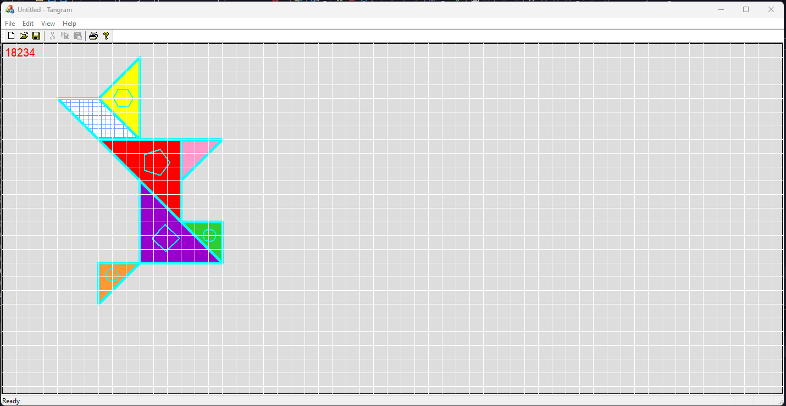

### Laboratorijska vezba 2 - Cactus

- Fokus vezbe - rad sa metafajlovima i svetske (globalne) transformacije; tekst i fontovi;

- Kod:
  - [Header](./Metafajlovi/Metafajlovi/MetafajloviView.h)
  - [Implementacija](./Metafajlovi/Metafajlovi/MetafajloviView.cpp)

Rezultat:

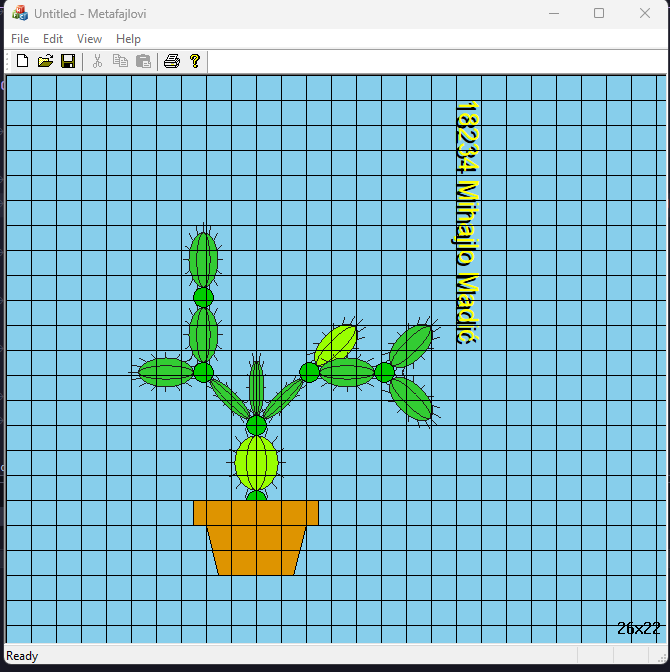

### Laboratorijska vezba 3 - MonaPuzzle

- Fokus vezbe - rad sa bitmapama, (ucitavanje, iscrtavanje, transparencija, filtriranje);

- Kod:
  - [Header](./MonaPuzzle/MonaPuzzle/MonaPuzzleView.h)
  - [Implementacija](./MonaPuzzle/MonaPuzzle/MonaPuzzleView.cpp)

Rezultat:

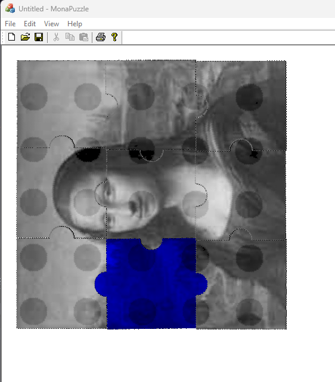


## Reusable kod

### Miscellaneous

- Konverzija stepena u radijane
```c++
#define _USE_MATH_DEFINES
#include "math.h"

#define DEG2RAD(x) ((2. * M_PI * x) / 360.)
```

- Grid
```c++
void CGenericProjectNameView::DrawGrid(CDC* pDC)
{
	CRect rcClient;
	GetClientRect(&rcClient);

	for (int cursor = gridUnitSize; cursor < rcClient.Width(); cursor += gridUnitSize)
		pDC->MoveTo(cursor, 0), pDC->LineTo(cursor, rcClient.Height());

	for (int cursor = gridUnitSize; cursor < rcClient.Height(); cursor += gridUnitSize)
		pDC->MoveTo(0, cursor), pDC->LineTo(rcClient.Width(), cursor);

	TCHAR gridSizeTextString[32];
	wsprintf(gridSizeTextString, _T("%dx%d"), widthInGridUnits, heightInGridUnits);
	CString gridSizeText(gridSizeTextString);

	CPoint gridSizeTextExtent = pDC->GetTextExtent(gridSizeText);

	int oldBkMode = pDC->SetBkMode(TRANSPARENT);
	pDC->TextOutW(windowWidth - gridSizeTextExtent.x - 5, windowHeight - gridSizeTextExtent.y - 5, gridSizeText);
	pDC->SetBkMode(oldBkMode);
}
```

- Koordinatne ose
```c++
void CGenericProjectNameView::DrawAxes(CDC* pDC)
{
	CPen redPen{ PS_COSMETIC | PS_SOLID, 0, RGB(255, 0, 0) };
	CPen greenPen{ PS_COSMETIC | PS_SOLID, 0, RGB(0, 255, 0) };

	// x axis
	CPen* oldPen = pDC->SelectObject(&greenPen);
	pDC->MoveTo(0, 0);
	pDC->LineTo(100, 0);

	// y axis
	pDC->SelectObject(&redPen);
	pDC->MoveTo(0, 0);
	pDC->LineTo(0, 100);

	pDC->SelectObject(oldPen);

	redPen.DeleteObject();
	greenPen.DeleteObject();
}
```

### Transformacije

- Translacija
```c++
void CGenericProjectNameView::Translate(CDC* pDC, FLOAT Dx, FLOAT Dy, DWORD mode)
{
	const XFORM translationMatrix{
		1.f, 0.f,
		0.f, 1.f,
		Dx, Dy,
	};
	pDC->ModifyWorldTransform(&translationMatrix, mode);
}
```

- Rotacija
```c++
void CGenericProjectNameView::Rotate(CDC* pDC, FLOAT angle, DWORD mode)
{
	const XFORM rotationMatrix{
		cosf(angle), sinf(angle),
		-sinf(angle), cosf(angle),
		0.f, 0.f,
	};
	pDC->ModifyWorldTransform(&rotationMatrix, mode);
}
```

- Skaliranje
```c++
void CGenericProjectNameView::Scale(CDC* pDC, FLOAT Sx, FLOAT Sy, DWORD mode)
{
	const XFORM scalingMatrix{
		Sx, 0.f,
		0.f, Sy,
		0.f, 0.f,
	};
	pDC->ModifyWorldTransform(&scalingMatrix, mode);
}
```

- Inverzija (Mirror)
```c++
void CGenericProjectNameView::Mirror(CDC* pDC, BOOL Mx, BOOL My, DWORD mode)
{
	const XFORM matrix{
		Mx ? -1.f : 1.f, 0.f,
		0.f, My ? -1.f : 1.f,
		0.f, 0.f,
	};
	pDC->ModifyWorldTransform(&matrix, mode);
}
```

- Kopiranje bitmape
```c++
void CGenericProjectNameView::CopyBitmap(CDC* pDC, CBitmap* dstBmp, CBitmap* srcBmp)
{
	// Get bitmap information from the source bitmap
	BITMAP bitmapInfo;
	srcBmp->GetBitmap(&bitmapInfo);

	// Create a memory device context (CDC) compatible with the screen
	CDC sourceDC, destDC;
	sourceDC.CreateCompatibleDC(pDC);  // Source DC
	destDC.CreateCompatibleDC(pDC);    // Destination DC

	// Select the source bitmap into the source device context
	CBitmap* pOldSourceBitmap = sourceDC.SelectObject(srcBmp);

	// Create a new destination bitmap with the same size as the source
	dstBmp->CreateCompatibleBitmap(&sourceDC, bitmapInfo.bmWidth, bitmapInfo.bmHeight);

	// Select the destination bitmap into the destination device context
	CBitmap* pOldDestBitmap = destDC.SelectObject(dstBmp);

	// Copy the source bitmap to the destination bitmap
	destDC.BitBlt(0, 0, bitmapInfo.bmWidth, bitmapInfo.bmHeight, &sourceDC, 0, 0, SRCCOPY);

	// Clean up: restore the old bitmaps and delete the device contexts
	sourceDC.SelectObject(pOldSourceBitmap);
	destDC.SelectObject(pOldDestBitmap);
}
```

- Transparencija
```c++
void CGenericProjectNameView::DrawPuzzle(CDC* pDC, DImage& image, int x, int y, BOOL blueFilter)
{
	int bitmapWidth = image.Width(), bitmapHeight = image.Height();

	CBitmap copy;
	CopyBitmap(pDC, &copy, image.GetBitmap());

	CBitmap mask;
	mask.CreateBitmap(bitmapWidth, bitmapHeight, 1, 1, NULL);

	// Part 1 - create DC that will contain source image (bitmap) - source DC,
	// and a DC where we will create our filtering mask - destination DC.

	CDC srcDC{};
	srcDC.CreateCompatibleDC(pDC);
	CDC dstDC{};
	dstDC.CreateCompatibleDC(pDC);

	CBitmap* oldSrcBitmap = srcDC.SelectObject(&copy);
	CBitmap* dstOldBitmap = dstDC.SelectObject(&mask);

	// Setting bk color for srcDC (this color will be filtered in the end).
	COLORREF srcTopLeftPixel = srcDC.GetPixel(0, 0);
	COLORREF oldSrcBkColor = srcDC.SetBkColor(srcTopLeftPixel);

	// Mask formed - pixel takes value 0 if the corresponding pixel from srcDC is colored
	// with the srcDC bk color, elsewhere 1 (the mask is kinda inverse, because default bk color is white).
	dstDC.BitBlt(0, 0, bitmapWidth, bitmapHeight, &srcDC, 0, 0, SRCCOPY);

	// Filtering takes place here. After this step, inside our source DC
	// there will be a filtered version of our source image.
	COLORREF oldSrcTextColor = srcDC.SetTextColor(RGB(255, 255, 255));
	srcDC.SetBkColor(RGB(0, 0, 0));
	srcDC.BitBlt(0, 0, bitmapWidth, bitmapHeight, &dstDC, 0, 0, SRCAND);

	// Final drawing to pDC - mask and then picture 'over' it.
	pDC->BitBlt(x, y, bitmapWidth, bitmapHeight, &dstDC, 0, 0, SRCAND);
	pDC->BitBlt(x, y, bitmapWidth, bitmapHeight, &srcDC, 0, 0, SRCPAINT);

	// Releasing resources.
	dstDC.SelectObject(dstOldBitmap);
	dstDC.DeleteDC();
	srcDC.SelectObject(oldSrcBitmap);
	srcDC.DeleteDC();
}
```

- BGRA (32bit svaki piksel) to GRAYSCALE
```c++
void CGenericProjectNameView::BGRA2Greyscale(CBitmap* bitmap)
{
	BITMAP bitmapInfo;
	bitmap->GetBitmap(&bitmapInfo);

  if (bitmapInfo.bmBitsPixel != 32)
  {
    AfxMessageBox(L"Not a BGRA image!");
    exit(-1);
  }

  // Should be colorsPerPixel == 4.
	int colorsPerPixel = bitmapInfo.bmBitsPixel / CHAR_BIT; // CHAR_BIT == number of bits in a byte, i.e. 8.
	long bmpSize = bitmapInfo.bmWidth * bitmapInfo.bmHeight * colorsPerPixel;

	BYTE* lpBits = new BYTE[bmpSize];
	bitmap->GetBitmapBits(bmpSize, lpBits);

	int threshold = 30;
	BYTE transparencyMask[3]{ lpBits[0], lpBits[1], lpBits[2], };

	for (long i = 0; i < bmpSize; i += colorsPerPixel)
	{
		BYTE b = lpBits[i];
		BYTE g = lpBits[i + 1];
		BYTE r = lpBits[i + 2];

		if (transparencyMask[0] == r &&
			transparencyMask[1] == g &&
			transparencyMask[2] == b)
			continue;

		BYTE gray = threshold + (b + g + r) / 3;

		if (gray > threshold) {
			lpBits[i] = gray;
			lpBits[i + 1] = gray;
			lpBits[i + 2] = gray;
		}
	}

	bitmap->SetBitmapBits(bmpSize, lpBits);
	delete[] lpBits;
}
```

## Racunske vezbe

### Prvi termin vezbi - 2D grafika primenom GDI

- GDI (Graphics Device Interface) - 2D graficki API, dizajniran za C++ programere;
- Softverska podrska nezavisno od uredjaja ostvarena je kroz 2 DLL-a - Gdi.dll i drajvera uredjaja (npr. Epson9.dll);
- DC - **Device Context** - struktura podataka koja definise skup grafickih objekata i njima dodeljenih atributa, kao i graficke rezime (modove) koji uticu na prikaz;
- 4 tipa konteksta uredjaja - prikazni (**Display**), printerski (Printer), memorijski (**Memory**), informativni (Information);
- `CDC *CWnd::GetDC();` - u MFC-u, funkcije za rad sa DC-jem inkapsulirane su u klasi `CDC`;
- `void CP1View::OnDraw(CDC *pDC) { ... }` - u ovoj funkciji pisemo sav kod;
- kompontente DC-a - atributi, graficki modovi, graficki objekti;
- Boje teksta i pozadine:
  - Text color - boja kojom se ispisuje tekst i ujedno foreground boja; 
  - Background color - boja pozadine;
  - `COLORREF` - struktura zaduzena za boju; 32bit, definise RGB boju u formatu _oxOObbggrr_;
    - RGB(255, 0, 0) - crvena, RGB(0, 255, 0) - zelena, RGB(0, 0, 255) - plava;
    - `#define RGB(r, g ,b) ((DWORD) (((BYTE) (r) | ((WORD) (g) << 8)) | (((DWORD) (BYTE) (b)) << 16)))` - makro koji olaksava kreiranje boja;
    - makroi za 'cupanje' boja:
      - `#define GetRValue(rgb) ((BYTE) (rgb))` - crvena;
      - `#define GetGValue(rgb) ((BYTE) (((WORD) (rgb)) >> 8))` - zelena;
      - `#define GetBValue(rgb) ((BYTE) ((rgb) >> 16))` - plava;
- Graficki modovi:
  - *background* - definise nacin mesanja pozadinske boje sa drugim bojama bitmapa/teksta;
  - *drawing* - definise nacin mesanja foreground boje sa drugim bojama olovaka, cetki, bitmapa ili teksta;
  - *mapping* - definise kako se koordinate mapiraju iz logickih u fizicke;
  - *polygon-fill* - definise kako se sablon cetke koristi za ispunu kompleksnih regiona;
  - *stretching* - definise kako se boje bitmape mesaju sa drugim bojama u prozoru kada je bitmapa kompresovana ili smanjena;
- Snimanje/vracanje stanja DC-a - `virtual int CDC::SaveDC();` i `BOOL CDC::RestoreDC(int nSavedDC)`;

### Drugi termin vezbi - Graficki objekti - Olovke i cetke

- Graficki objekti:
  - Olovke (Pen) - koristi se za iscrtavanje linija i krivih;
  - Cetke (Brushes) - za ispunu unutrasnjosti poligona, elipsi i putanja (paths);
  - Bitmape (Bitmaps) - za kreiranje, manipulaciju i skladistenje slika na disku, za kopiranje i skrolovanje delova ekrana;
  - Fontovi (Fonts) - za ispis teksta na ekranu i drugim izlaznim uredjajima;
  - Logicka paleta (Logical Pallete) - paleta boja koju aplikacija kreira i dodeljuje datom DC-u; definise skup raspolozivih boja;
  - Putanje (Paths) - jedan ili vise oblika koji mogu biti ispunjeni, uokvireni ili i jedno i drugo;
  - Regioni (Regions) - pravougaonik, poligon ili elipsa, koji se moze ispuniti, obojiti, invertovati, uokviriti, koristi se za ispitivanje polozaja kursora (hit-testing), ili odsecanje (clipping);
- Promena atributa objekata - kada aplikacija kreira DC, sistem automatski postavlja podrazumevane objekte i njihove atribute (osim bitmape i putanje);
  - Da bi se promenile podrazumevane vrednosti atributa, mora se
    1. Napraviti novi objekat odgovarajuceg tipa;
    2. Sacuvati prethodni objekat tog tipa;
    3. Selektovati novi objekat u DC;
  - Po zavrsetku koriscenja novog objekta, mora se:
    1. Selektovati prethodni objekat u DC;
    2. Obrisati kreirani (novi) objekat;

#### Olovke

- Tipovi olovaka:
  - kozmeticka olovka - koristi se kada se zahteva fiksna debljina (1px, ali se za debljinu predaje parametar `0` da bi se izabrala);
  - geometrijska olovka - koristi se kada postoji skaliranje linije, definisani spojevi, debljina veca od jednog piksela, ...;
- atributi standardne olovke su - debljina, stil i boja - `CPen::CPen(int nPenStyle, int nWidth, COLORREF crColor)`;
  - stilovi - `PS_SOLID`, `PS_DASH`, `PS_DOT`, `PS_DASHDOT`, `PS_DASHDOTDOT`, `PS_NULL`, `PS_INSIDEFRAME`;
  - debljina - `0` za kozmeticku; parametar `nPenStyle` se prihvata jedino ako je olovka kozmeticka, u suprotnom je `PS_SOLID`;
  - boja - `RGB` makro za definiciju `COLORREF`-a;
- atributi prosirene geometrijske olovke - preskok;
- Background mode moze biti `OPAQUE` ili `TRANSPARENT` - `int CDC::GetBkMode()`, `int CDC::SetBkMode(int iBkMode)`;

#### Cetka

- Ispuna unutrasnjosti figura kao sto je pravougaonik, polygon, elipsa ili putanja;
- konstruktori:
  - `CBrush::CBrush(COLORREF crColor)` - puna cetka;
  - `CBrush::CBrush(int nIndex, COLORREF crColor)` - cetka sa srafurom (hatched brush); 
  - `CBrush::CBrush(CBitmap *pBitmap)` - cetka sa internom bitmapom;
  - cetka sa eksternom bitmapom - preskok;
- moze se podesavati brush origin - `CPoint CDC::SetBrushOrg(int x, int y)`, `CPoint CDC::GetBrushOrg()`;
- Polygon-fill mod - kako se sablon cetke koristi za ispunu kompleksnih regiona i moze biti:
  - `ALTERNATE` - ispunjava oblasti izmedju neparnog i parnog broja ivica koje preseca scan-linija, ili 
  - `WINDING` - ispunjava svaki region sa nenultom winding vrednoscu;
  - funkcije - `int CDC::GetPolyFillMode()` i `int CDC::SetPolyFillMode(int iPolyFillMode)`;

#### 'Gotovi', *out-of-the-box* GDI objekti

- `virtual GdiObject *CDC::SelectStockObject(int nIndex)` - funkcija za hvatanje gotovih objekata;
- olovke - `BLACK_PEN`, `NULL_PEN`, `WHITE_PEN`;
- cetke - `DKGRAY_BRUSH`, `GRAY_BRUSH`, `HOLLOW_BRUSH`, `LTGRAY_BRUSH`, `NULL_BRUSH`, `WHITE_BRUSH`;

### Treci termin vezbi - Crtanje primitiva

#### Crtanje tacke

- `COLORREF CDC::GetPixel(int x, int y) const`;
- `COLORREF CDC::GetPixel(POINT point) const`;
- `COLORREF CDC::SetPixel(int x, int y, COLORREF crColor)`;
- `COLORREF CDC::SetPixel(POINT point, COLORREF crColor)`;

- x i y su logicke koordinate tacke;
- mogu biti definisane i pomocu strukture `POINT` i `CPoint`;
- crColor - boja na koju se postavlja piksel;

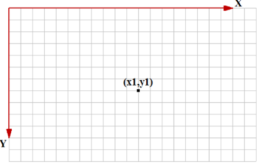

#### Crtanje linija i mnogouglova

##### Crtanje linije

- `CPoint CDC::MoveTo(int x, int y)`;
- `CPoint CDC::MoveTo(POINT point)`;
- `CPoint CDC::LineTo(int x, int y)`;
- `CPoint CDC::LineTo(POINT point)`;

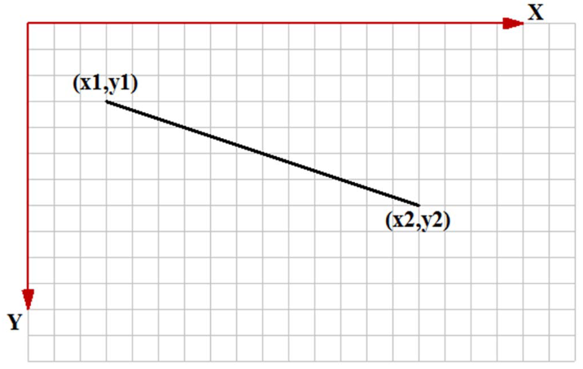

##### Crtanje poligonalne linije

- `BOOL CDC::Polyline(LPPOINT lpPoints, int nCount)` - crtanje jedne izlomljene linije;
- `BOOL CDC::PolyPolyline(const POINT *lpPoints, const DWORD *lpPolyPoints, int nCount)` - crtanje niza izlomljenih linija;
  - `lpPoints` - niz temena svih izlomljenih linija;
  - `lpPolyPoints` - niz brojeva, gde je svaki element broj tacaka jedne izlomljene;
  - `nCount` - broj izlomljenih linija (najmanje 2);

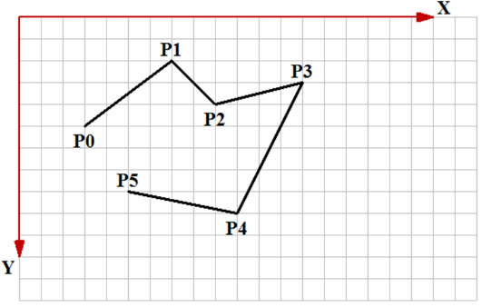

##### Crtanje mnogougla

- `BOOL CDC::Polygon(LPPOINT lpPoints, int nCount)` - crtanje jednog poligona;
- `BOOL CDC::PolyPolygon(const POINT *lpPoints, const DWORD *lpPolyPoints, int nCount)` - crtanje niza mnogouglova;

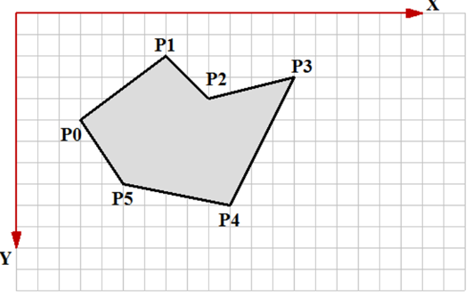

#### Crtanje pravougaonika i elipsi

##### Crtanje pravougaonika (paralelnog koordinatnim osama)

- `BOOL CDC::Rectangle(int x1, int y1, int x2, int y2)` - crtanje pravougaonika;
  - (x1, y1) (ili left, top) formiraju gornje levo teme;
  - (x2, y2) (ili right, bottom) formiraju donje desno teme;
- `BOOL CDC::Rectangle(LPCRECT lpRect)` - crtanje prosledjivanjem objekta tipa `CRect`;

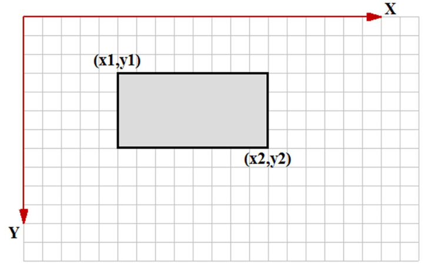

##### Crtanje elipsi (paralelne koordinatnim osama)

- Elipsa se crta pomocu pravougaonika => prosledjuje se pravougaonik ili koordinate njegovih temena, a biva iscrtana upisana elipsa;
- `BOOL CDC::Ellipse(int x1, int y1, int x2, int y2)` - crtanje pravougaonika;
  - (x1, y1) (ili left, top) formiraju gornje levo teme;
  - (x2, y2) (ili right, bottom) formiraju donje desno teme;
- `BOOL CDC::Ellipse(LPCRECT lpRect)` - crtanje prosledjivanjem objekta tipa `CRect`;

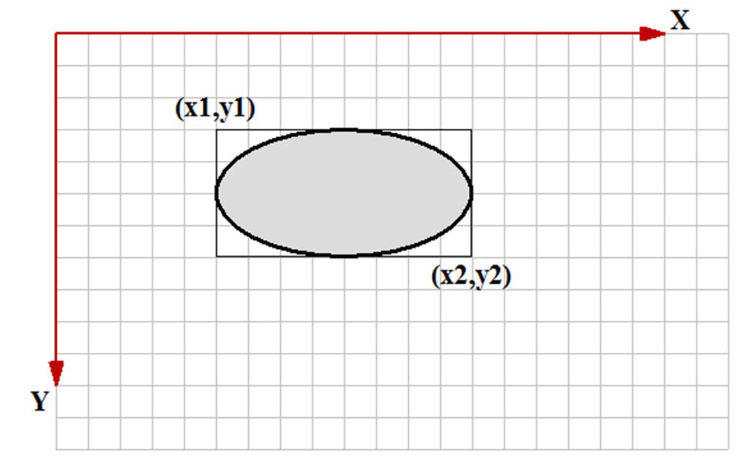

##### Crtanje zaobljenog pravougaonika (paralelnog koordinatnim osama)

- Crtanje zaobljenog pravougaonika paralelnog koordinatnim osama;
  - `BOOL CDC::RoundRect(int x1, int y1, int x2, int y2, int x3, int y3)`;
  - `BOOL CDC::RoundRect(LPCRECT lpRect, POINT point)`;

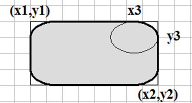

#### Crtanje lukova i lucnih oblika

##### Crtanje luka (elipse paralelne koordinatnim osama)

- `BOOL CDC::Arc(int x1, int y1, int x2, int y2, int x3, int y3, int x4, int y4)`;
- `BOOL CDC::Arc(LPCRECT lpRect, POINT ptStart, POINT ptEnd)`;

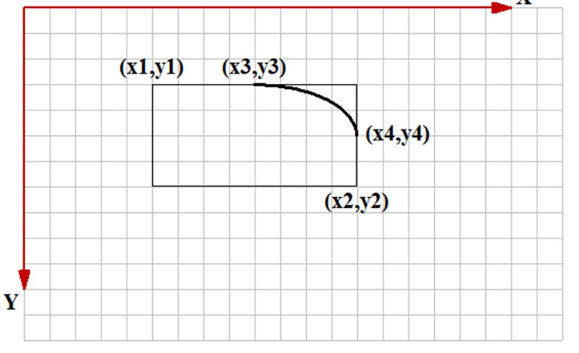

- Takodje, moze se podesavati orijentacija luka:
  - `int CDC::GetArcDirection()`;
  - `int CDC::SetArcDirection(int nArcDirection)`;
  - orijentacija luka - `AD_COUNTERCLOCKWISE` i `AD_CLOCKWISE`;

##### Crtanje pite

- `BOOL CDC::Pie(int x1, int y1, int x2, int y2, int x3, int y3, int x4, int y4)`;
- `BOOL CDC::Pie(LPCRECT lpRect, POINT ptStart, POINT ptEnd)`;

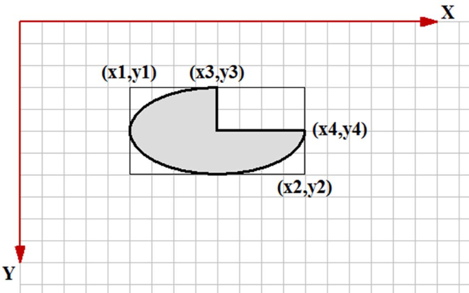

##### Crtanje odsecka

- `BOOL CDC::Chord(int x1, int y1, int x2, int y2, int x3, int y3, int x4, int y4 )`;
- `BOOL CDC::Chord(LPCRECT lpRect, POINT ptStart, POINT ptEnd)`;

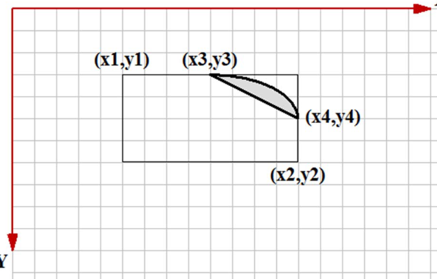

#### Crtanje Bezier-ove krive

- Crtanje krive linije definisane Bezier-ovom krivom - `BOOL CDC::PolyBezier(const POINT* lpPoints, int nCount)`;

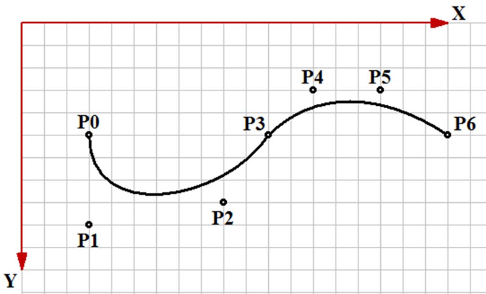

### Cetvrti termin vezbi - Font

#### Osnove - fontovi

- Fontovi su GDI objekti koji definisu nacin ispisa teksta;
- Termini:
  - *glyph* - pojedinacni znak;
  - *font* - kolekcija znakova sa istim dizajnom;
  - *font family* - skup fontova koji dele isti osnovni dizajn;
  - *typeface* - dizajn fonta;
  - *pitch* - sirina pojedinacnog znaka;
    - *fixed* - svi znaci iste sirine;
    - *variable* - neki karakteri siri, neki uzi - varijabilna sirina;
  - *serif* - crtice na krajevima karaktera;
- Tipovi:
  - *rasterski* - pomocu bitmapa;
  - *vektorski* - definisani primitivama;
  - *TrueType* - najfleksibilniji, sacinjeni od linija i krivih i dodatnih informacija o svakom znaku;
  - *OpenType* - prosirenje *TrueType*-a tako da podrzava Adobe PostScript Compact fajl format;
  - *ClearType* - Microsoft implementacija subpikselnog iscrtavanja fontova;
- Familija fontova:
  - *decorative* - novi, ukrasni fontovi;
  - *dontcare* - genericki, informacija o familiji ne postoji ili je irelevantna;
  - *modern* - fontovi sa fiksnom sirinom;
  - *roman* - fontovi promenljive sirine;
  - *script* - fontovi nalik pisanim slovima;
  - *swiss* - fontovi promenljive sirine;

- `CFont` - MFC klasa kopja omogucuje upravljanje ispisom teksta; ima samo podrazumevani konstruktor;
- jedini nacin da se zadaju parametri je pozivom funkcije `CreateFont()` - ima 14 parametara, ali je uglavnom potrebno zadati prvi i zadnji parametar - *height* i *naziv* fonta;
  - `CFont font; font.CreateFont(20, 0, 0, 0, 0, 0, 0, 0, 0, 0, 0, 0, 0, 0, _T("Times New Roman"));`

- Funkcija za ispis teksta:
  - `BOOL CDC::TextOut(int x, int y, const Cstring& str)`;
  - `virtual BOOL CDC::TextOut(int x, int y, LPCTSTR lpszString, int nCount)`;

- preskocen znacajan deo oko specijalnih podesavanja, rotacija, itd; procitaj ovo, necu da ga prepisujem;

- stock fontovi:
  - `ANSI_FIXED_FONT` - sistemski font fiksne sirine karaktera;
  - `ANSI_VAR_FONT` - sistemski font promenljive sirine karaktera;
  - `DEVICE_DEFAULT_FONT` - font zavistan od uredjaja;
  - `DEFAULT_GUI_FONT` - podrazumevani font namenjen ispisu teksta na korisnickom interfejsu;
  - `OEM_FIXED_FONT` - font fiksne sirine karaktera zavistan od OEM-a;
  - `SYSTEM_FONT` - sistemski font;

#### Metrike fontova

##### Horizontalna

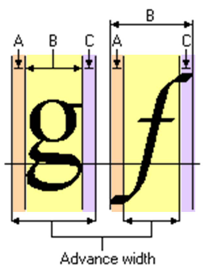
- `BOOL CDC::GetCharABCWidths(UINT nFirstChar, UINT nLastChar, LPABC lpabc)`;
- `BOOL CDC::GetCharWidth(UINT nFirstChar, UINT nLastChar, LPABC lpBuffer)`;
  - `lpBuffer` i `lpabc` moraju imati duzinu od barem *nLastChar - nFirstChar + 1*;

##### Vertikalna

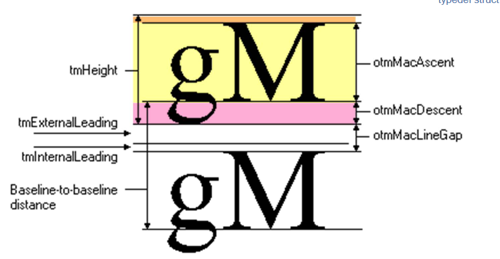
- `CSize CDC::GetTextExtent(const CString& str)` - racuna velicinu (sirinu i visinu) prosledjenog teksta ispisanog trenutno selektovanim fontom;

#### Najbitnija slika - fontovi


### Peti termin vezbi - koordinatni prostori i 2D transformacije

- ravan u kojoj se koristi Dekartov koordinatni sistem;
- postoje 4 koordinatna prostora:
  - *world*;
  - *page*;
  - *device*;
  - *physical device*;
- transformacija je algoritam po kome se menja velicina, orijentacija, polozaj i/ili oblik objekata;

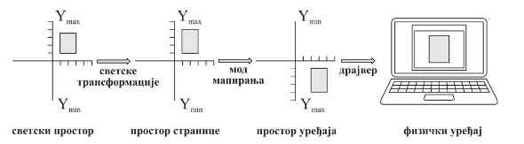

- ovaj deo je bitan:

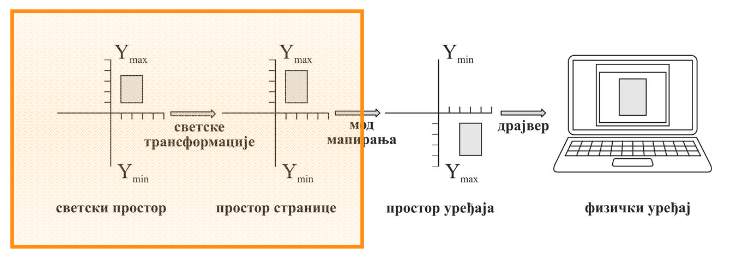

- preslikavanje lokalnih u svetske koordinate - omogucuje transformacije - translacija, skaliranje, rotacija, smicanje, refleksija;

#### Modovi mapiranja

- `MM_TEXT` - default mod, 1 logicka jedinica se mapira na jedan piksel;
- `MM_ISOTROPIC` - logicke jedinice mapiraju se u proizvoljne fizicke, ali sa ogranicenjem da je jednako skaliranje po obe ose;
- `MM_ANISOTROPIC` - logicke jedinice mapiraju se u proizvoljne fizicke;

- Funkcije preslikavanja:
  - `int CDC::GetMapMode()` i `int CDC::SetMapMode(int fnMapMode)`;
  - `BOOL CDC::SetWindowExt(int nXExtentW, int nYExtentW)` i `BOOL CDC::SetViewportExt(int nXExtentV, int nYExtentV)`;


- Funkcije postavljanja koordinatnog pocetka:
  - `BOOL CDC::SetWindowOrg(int X, int Y)` i `BOOL CDC::SetViewportOrg(int X, int Y)`;

#### Geometrijske Transformacije

- preslikavanje svetskog u prostor stranice;
- elementarne 2D transformacije:

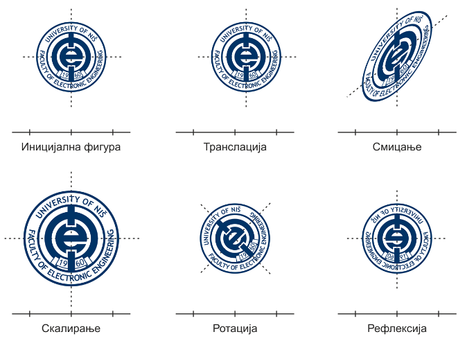

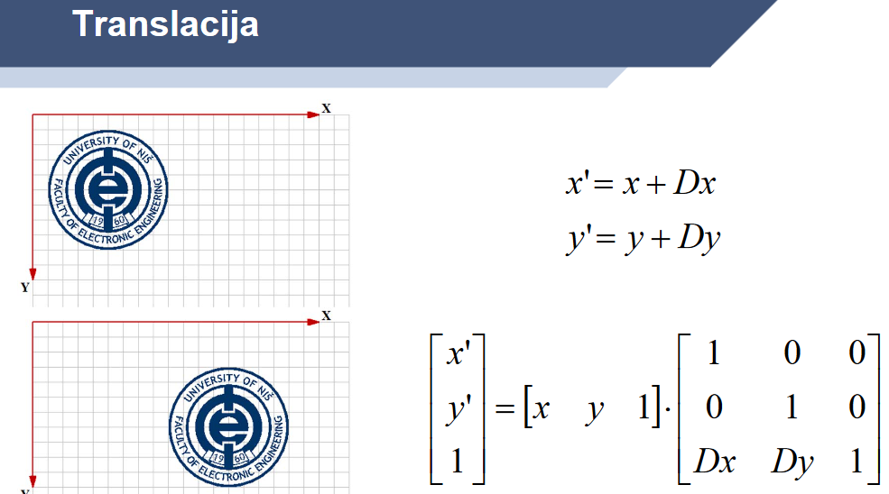

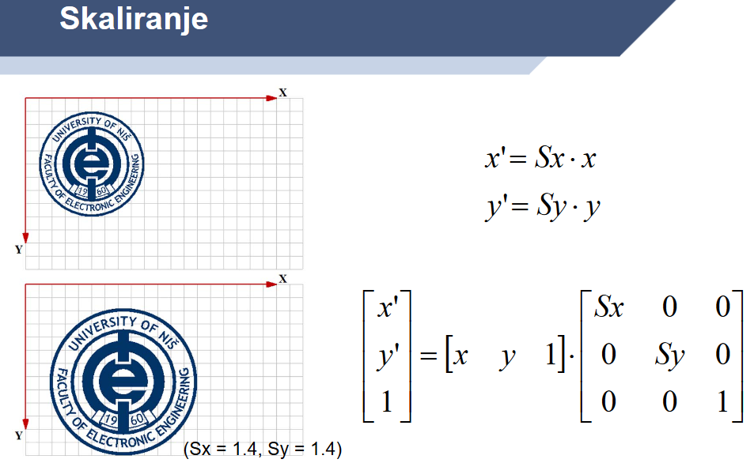


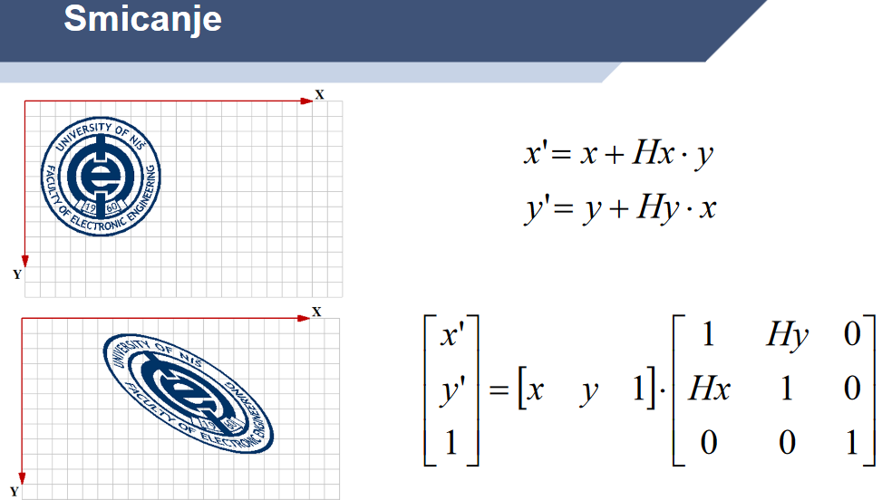

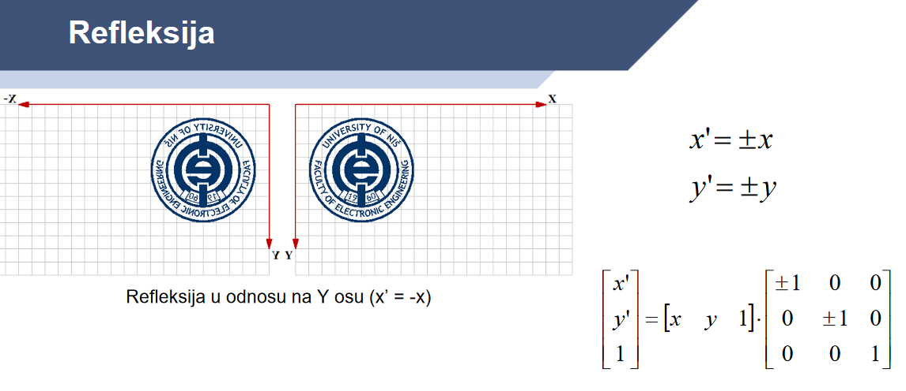

- `XFORM` struktura - definise matricu transformacije na sledeci nacin:

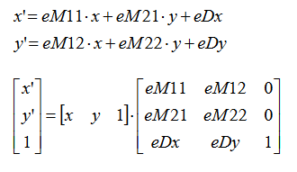

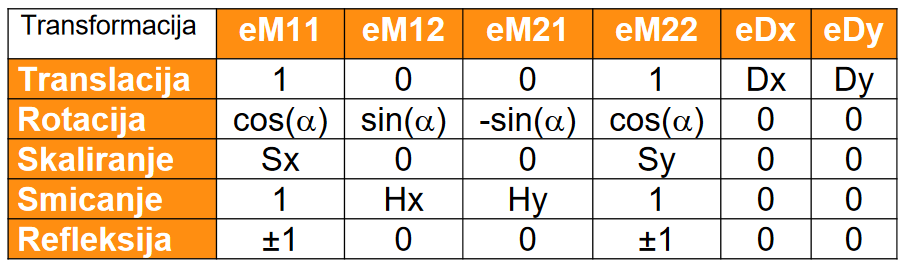

- `BOOL CDC::SetWorldTransform(const XFORM *lpXform)` - transformacija;
- pre funkcije iznad, treba se pozvati `int CDC::SetGraphicsMode(int iMode)` i `GM_ADVANCED`;

- metod za izmenu trenutne transformacije DC-a - `BOOL CDC::ModifyWorldTransform(const XFORM* lpXform, DWORD iMode)`;
  - `iMode` moze biti `WMT_IDENTITY`, `MWT_LEFTMULTIPLY` i `MWT_RIGHTMULTIPLY`;

- pogledi posmatranja - ima ih 2, *globalni* i *lokalni* - procitaj;

- `BOOL CombineTransform(LPXFORM lpxformResult, const XFORM* lpxform1, const XFORM* lpxform2)`;
  - opisano pseudo-kodom - matrix_multiply(result, op_left, op_right);

### Sesti termin vezbi - Metafajlovi

- standardni (Windows) metafajlovi cuvaju se u datotekama sa ekstenzijom WMF, dok unapredjeni format ima ekstenziju EMF (Enhanced);

#### Standardni metafajlovi - preskoceno

#### Unapredjeni metafajlovi

- kreiranje - preskoceno;

- ucitavanje, kopiranje, crtanje i brisanje:
  - `HENHMETAFILE GetEnhMetaFile(LPCTSTR lpszMetaFile)` - ucitavanje;
  - `HENHMETAFILE CopyEnhMetaFile(HENHMETAFILE hmfSrc, LPCTSTR lpszFile)` - kopiranje;
  - `BOOL CDC::PlayMetaFile(HENHMETAFILE hMF, LPCRECT lpBounds)` - crtanje na osnovu zadatog pravougaonika;
  - `BOOL DeleteEnhMetaFile(HENHMETAFILE hMF)` - brisanje;

### Sedmi termin vezbi - Bitmape

- Obrati paznju - **transparencija**, **filtriranje**, pomocna biblioteka `DImage`;

- Treba da znas kako se ucitava slika - pomocu `DImage` klase;
- Treba da znas kako se iscrtava slika - takodje pomocu `DImage` klase;
- Iscrtavanje bitmape u njenoj prirodnoj velicini;
- Rasterske operacije - `SRCAND`, `SRCCOPY`, `SRCPAINT`;

- `CBitmap::CreateCompatibleBitmap(CDC* pDC, int nWidth, int nHeight)` - inicijalizacija objekta sa bitmapom tako da je kompatibilan sa navedenim uredjajem;
- `CBitmap::CreateBitmap(int nWidth, int nHeight, UINT nPlanes, UINT nBitcount, const void* lpBits)` - inicijalizacija objekta sa bitmapom iz memorije zavisnom od uredjaja, koja ima navedenu sirinu, visinu i niz bitova;
- `DWORD CBitmap::SetBitmapBits(DWORD dwCount, const void* lpBits)` - postavljanje niza bitova bitmape na navedene vrednosti;
- `DWORD CBitmap::GetBitmapBits(DWORD dwCount, LPVOID lpBits) const` - postavljanje niza bitova bitmape na navedene vrednosti;
- `BOOL CDC::BitBlt(int x, int y, int nWidth, int nHeight, CDC* pSrcDC, int xSrc, int ySrc, DWORD dwRop)` - 

```c++
DImage img;
img.Load(L"Path\\To\\Bitmap\\Image.bmp");
img.Draw(pDC, CRect{ 0, 0, img.Width(), img.Width() }, CRect{ 0, 0, img.Width(), img.Height() });
```

### Osmi termin vezbi - 

## References

- Stranica predmeta - CS;
- [Microsoft Learn - Windows GDI](https://learn.microsoft.com/en-us/windows/win32/gdi/windows-gdi);