# Windows GDI (Graphics Device Interface)

Back to [main page](../).

## Vezbe

### Prvi termin vezbi - 2D grafika primenom GDI

- GDI (Graphics Device Interface) - 2D graficki API, dizajniran za C++ programere;
- Softverska podrska nezavisno od uredjaja ostvarena je kroz 2 DLL-a - Gdi.dll i drajvera uredjaja (npr. Epson9.dll);
- DC - **Device Context** - struktura podataka koja definise skup grafickih objekata i njima dodeljenih atributa, kao i graficke rezime (modove) koji uticu na prikaz;
- 4 tipa konteksta uredjaja - prikazni (**Display**), printerski (Printer), memorijski (**Memory**), informativni (Information);
- `CDC *CWnd::GetDC();` - u MFC-u, funkcije za rad sa DC-jem inkapsulirane su u klasi `CDC`;
- `void CP1View::OnDraw(CDC *pDC) { ... }` - u ovoj funkciji pisemo sav kod;
- kompontente DC-a - atributi, graficki modovi, graficki objekti;
- Boje teksta i pozadine:
  - Text color - boja kojom se ispisuje tekst i ujedno foreground boja; 
  - Background color - boja pozadine;
  - `COLORREF` - struktura zaduzena za boju; 32bit, definise RGB boju u formatu _oxOObbggrr_;
    - RGB(255, 0, 0) - crvena, RGB(0, 255, 0) - zelena, RGB(0, 0, 255) - plava;
    - `#define RGB(r, g ,b) ((DWORD) (((BYTE) (r) | ((WORD) (g) << 8)) | (((DWORD) (BYTE) (b)) << 16)))` - makro koji olaksava kreiranje boja;
    - makroi za 'cupanje' boja:
      - `#define GetRValue(rgb) ((BYTE) (rgb))` - crvena;
      - `#define GetGValue(rgb) ((BYTE) (((WORD) (rgb)) >> 8))` - zelena;
      - `#define GetBValue(rgb) ((BYTE) ((rgb) >> 16))` - plava;
- Graficki modovi:
  - *background* - definise nacin mesanja pozadinske boje sa drugim bojama bitmapa/teksta;
  - *drawing* - definise nacin mesanja foreground boje sa drugim bojama olovaka, cetki, bitmapa ili teksta;
  - *mapping* - definise kako se koordinate mapiraju iz logickih u fizicke;
  - *polygon-fill* - definise kako se sablon cetke koristi za ispunu kompleksnih regiona;
  - *stretching* - definise kako se boje bitmape mesaju sa drugim bojama u prozoru kada je bitmapa kompresovana ili smanjena;
- Snimanje/vracanje stanja DC-a - `virtual int CDC::SaveDC();` i `BOOL CDC::RestoreDC(int nSavedDC)`;

### Drugi termin vezbi - Graficki objekti - Olovke i cetke

- Graficki objekti:
  - Olovke (Pen) - koristi se za iscrtavanje linija i krivih;
  - Cetke (Brushes) - za ispunu unutrasnjosti poligona, elipsi i putanja (paths);
  - Bitmape (Bitmaps) - za kreiranje, manipulaciju i skladistenje slika na disku, za kopiranje i skrolovanje delova ekrana;
  - Fontovi (Fonts) - za ispis teksta na ekranu i drugim izlaznim uredjajima;
  - Logicka paleta (Logical Pallete) - paleta boja koju aplikacija kreira i dodeljuje datom DC-u; definise skup raspolozivih boja;
  - Putanje (Paths) - jedan ili vise oblika koji mogu biti ispunjeni, uokvireni ili i jedno i drugo;
  - Regioni (Regions) - pravougaonik, poligon ili elipsa, koji se moze ispuniti, obojiti, invertovati, uokviriti, koristi se za ispitivanje polozaja kursora (hit-testing), ili odsecanje (clipping);
- Promena atributa objekata - kada aplikacija kreira DC, sistem automatski postavlja podrazumevane objekte i njihove atribute (osim bitmape i putanje);
  - Da bi se promenile podrazumevane vrednosti atributa, mora se
    1. Napraviti novi objekat odgovarajuceg tipa;
    2. Sacuvati prethodni objekat tog tipa;
    3. Selektovati novi objekat u DC;
  - Po zavrsetku koriscenja novog objekta, mora se:
    1. Selektovati prethodni objekat u DC;
    2. Obrisati kreirani (novi) objekat;

#### Olovke

- Tipovi olovaka:
  - kozmeticka olovka - koristi se kada se zahteva fiksna debljina (1px, ali se za debljinu predaje parametar `0` da bi se izabrala);
  - geometrijska olovka - koristi se kada postoji skaliranje linije, definisani spojevi, debljina veca od jednog piksela, ...;
- atributi standardne olovke su - debljina, stil i boja - `CPen::CPen(int nPenStyle, int nWidth, COLORREF crColor)`;
  - stilovi - `PS_SOLID`, `PS_DASH`, `PS_DOT`, `PS_DASHDOT`, `PS_DASHDOTDOT`, `PS_NULL`, `PS_INSIDEFRAME`;
  - debljina - `0` za kozmeticku; parametar `nPenStyle` se prihvata jedino ako je olovka kozmeticka, u suprotnom je `PS_SOLID`;
  - boja - `RGB` makro za definiciju `COLORREF`-a;
- atributi prosirene geometrijske olovke - preskok;
- Background mode moze biti `OPAQUE` ili `TRANSPARENT` - `int CDC::GetBkMode()`, `int CDC::SetBkMode(int iBkMode)`;

#### Cetka

- Ispuna unutrasnjosti figura kao sto je pravougaonik, polygon, elipsa ili putanja;
- konstruktori:
  - `CBrush::CBrush(COLORREF crColor)` - puna cetka;
  - `CBrush::CBrush(int nIndex, COLORREF crColor)` - cetka sa srafurom (hatched brush); 
  - `CBrush::CBrush(CBitmap *pBitmap)` - cetka sa internom bitmapom;
  - cetka sa eksternom bitmapom - preskok;
- moze se podesavati brush origin - `CPoint CDC::SetBrushOrg(int x, int y)`, `CPoint CDC::GetBrushOrg()`;
- Polygon-fill mod - kako se sablon cetke koristi za ispunu kompleksnih regiona i moze biti:
  - `ALTERNATE` - ispunjava oblasti izmedju neparnog i parnog broja ivica koje preseca scan-linija, ili 
  - `WINDING` - ispunjava svaki region sa nenultom winding vrednoscu;
  - funkcije - `int CDC::GetPolyFillMode()` i `int CDC::SetPolyFillMode(int iPolyFillMode)`;

#### 'Gotovi', *out-of-the-box* GDI objekti

- `virtual GdiObject *CDC::SelectStockObject(int nIndex)` - funkcija za hvatanje gotovih objekata;
- olovke - `BLACK_PEN`, `NULL_PEN`, `WHITE_PEN`;
- cetke - `DKGRAY_BRUSH`, `GRAY_BRUSH`, `HOLLOW_BRUSH`, `LTGRAY_BRUSH`, `NULL_BRUSH`, `WHITE_BRUSH`;

### Treci termin vezbi - Crtanje primitiva

#### Crtanje tacke

- `COLORREF CDC::GetPixel(int x, int y) const`;
- `COLORREF CDC::GetPixel(POINT point) const`;
- `COLORREF CDC::SetPixel(int x, int y, COLORREF crColor)`;
- `COLORREF CDC::SetPixel(POINT point, COLORREF crColor)`;

- x i y su logicke koordinate tacke;
- mogu biti definisane i pomocu strukture `POINT` i `CPoint`;
- crColor - boja na koju se postavlja piksel;

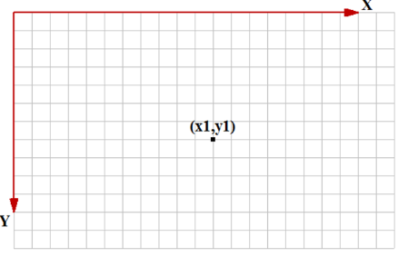

#### Crtanje linija i mnogouglova

##### Crtanje linije

- `CPoint CDC::MoveTo(int x, int y)`;
- `CPoint CDC::MoveTo(POINT point)`;
- `CPoint CDC::LineTo(int x, int y)`;
- `CPoint CDC::LineTo(POINT point)`;

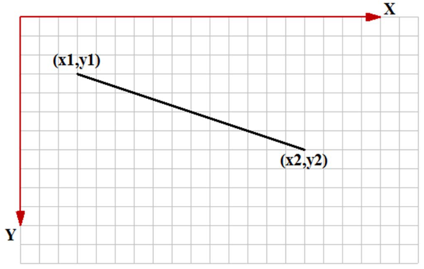

##### Crtanje poligonalne linije

- `BOOL CDC::Polyline(LPPOINT lpPoints, int nCount)` - crtanje jedne izlomljene linije;
- `BOOL CDC::PolyPolyline(const POINT *lpPoints, const DWORD *lpPolyPoints, int nCount)` - crtanje niza izlomljenih linija;
  - `lpPoints` - niz temena svih izlomljenih linija;
  - `lpPolyPoints` - niz brojeva, gde je svaki element broj tacaka jedne izlomljene;
  - `nCount` - broj izlomljenih linija (najmanje 2);

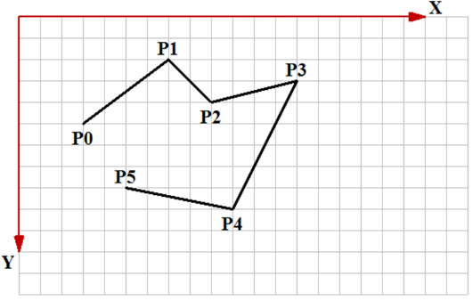

##### Crtanje mnogougla

- `BOOL CDC::Polygon(LPPOINT lpPoints, int nCount)` - crtanje jednog poligona;
- `BOOL CDC::PolyPolygon(const POINT *lpPoints, const DWORD *lpPolyPoints, int nCount)` - crtanje niza mnogouglova;

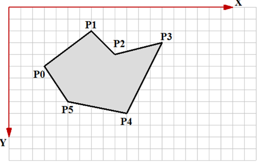

#### Crtanje pravougaonika i elipsi

##### Crtanje pravougaonika (paralelnog koordinatnim osama)

- `BOOL CDC::Rectangle(int x1, int y1, int x2, int y2)` - crtanje pravougaonika;
  - (x1, y1) (ili left, top) formiraju gornje levo teme;
  - (x2, y2) (ili right, bottom) formiraju donje desno teme;
- `BOOL CDC::Rectangle(LPCRECT lpRect)` - crtanje prosledjivanjem objekta tipa `CRect`;

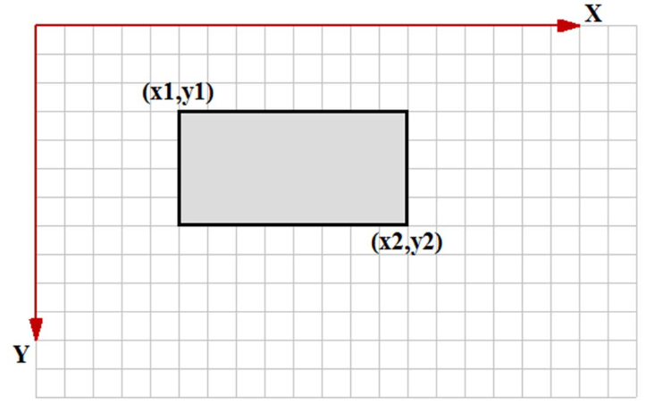

##### Crtanje elipsi (paralelne koordinatnim osama)

- Elipsa se crta pomocu pravougaonika => prosledjuje se pravougaonik ili koordinate njegovih temena, a biva iscrtana upisana elipsa;
- `BOOL CDC::Ellipse(int x1, int y1, int x2, int y2)` - crtanje pravougaonika;
  - (x1, y1) (ili left, top) formiraju gornje levo teme;
  - (x2, y2) (ili right, bottom) formiraju donje desno teme;
- `BOOL CDC::Ellipse(LPCRECT lpRect)` - crtanje prosledjivanjem objekta tipa `CRect`;

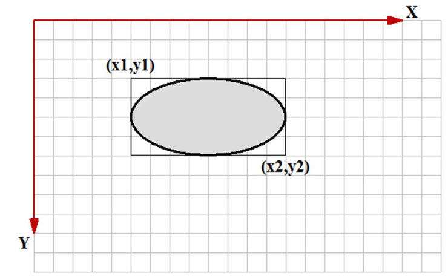

##### Crtanje zaobljenog pravougaonika (paralelnog koordinatnim osama)

- Crtanje zaobljenog pravougaonika paralelnog koordinatnim osama;
  - `BOOL CDC::RoundRect(int x1, int y1, int x2, int y2, int x3, int y3)`;
  - `BOOL CDC::RoundRect(LPCRECT lpRect, POINT point)`;

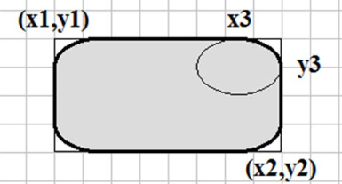

#### Crtanje lukova i lucnih oblika

##### Crtanje luka (elipse paralelne koordinatnim osama)

- `BOOL CDC::Arc(int x1, int y1, int x2, int y2, int x3, int y3, int x4, int y4)`;
- `BOOL CDC::Arc(LPCRECT lpRect, POINT ptStart, POINT ptEnd)`;

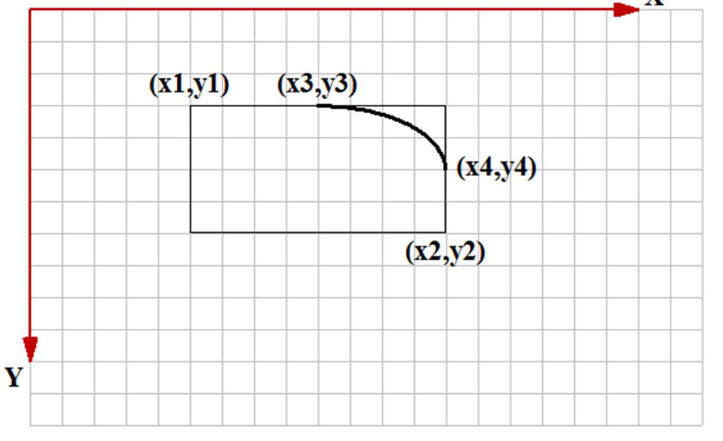

- Takodje, moze se podesavati orijentacija luka:
  - `int CDC::GetArcDirection()`;
  - `int CDC::SetArcDirection(int nArcDirection)`;
  - orijentacija luka - `AD_COUNTERCLOCKWISE` i `AD_CLOCKWISE`;

##### Crtanje pite

- `BOOL CDC::Pie(int x1, int y1, int x2, int y2, int x3, int y3, int x4, int y4)`;
- `BOOL CDC::Pie(LPCRECT lpRect, POINT ptStart, POINT ptEnd)`;

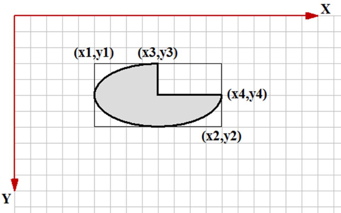

##### Crtanje odsecka

- `BOOL CDC::Chord(int x1, int y1, int x2, int y2, int x3, int y3, int x4, int y4 )`;
- `BOOL CDC::Chord(LPCRECT lpRect, POINT ptStart, POINT ptEnd)`;

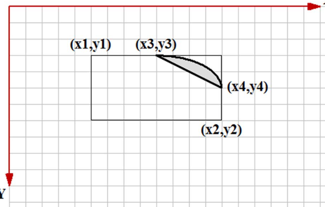

#### Crtanje Bezier-ove krive

- Crtanje krive linije definisane Bezier-ovom krivom - `BOOL CDC::PolyBezier(const POINT* lpPoints, int nCount)`;

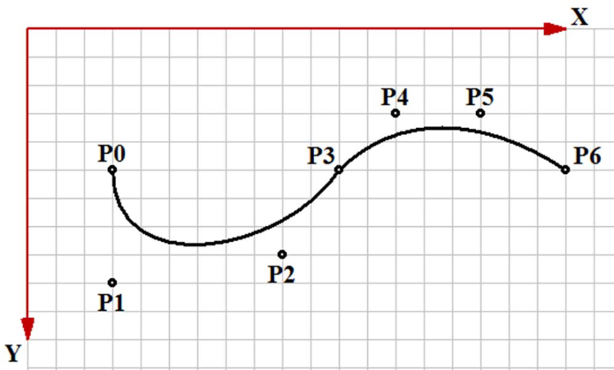

### Cetvrti termin laboratorijskih vezbi - Font

#### Osnove - fontovi

- Fontovi su GDI objekti koji definisu nacin ispisa teksta;
- Termini:
  - *glyph* - pojedinacni znak;
  - *font* - kolekcija znakova sa istim dizajnom;
  - *font family* - skup fontova koji dele isti osnovni dizajn;
  - *typeface* - dizajn fonta;
  - *pitch* - sirina pojedinacnog znaka;
    - *fixed* - svi znaci iste sirine;
    - *variable* - neki karakteri siri, neki uzi - varijabilna sirina;
  - *serif* - crtice na krajevima karaktera;
- Tipovi:
  - *rasterski* - pomocu bitmapa;
  - *vektorski* - definisani primitivama;
  - *TrueType* - najfleksibilniji, sacinjeni od linija i krivih i dodatnih informacija o svakom znaku;
  - *OpenType* - prosirenje *TrueType*-a tako da podrzava Adobe PostScript Compact fajl format;
  - *ClearType* - Microsoft implementacija subpikselnog iscrtavanja fontova;
- Familija fontova:
  - *decorative* - novi, ukrasni fontovi;
  - *dontcare* - genericki, informacija o familiji ne postoji ili je irelevantna;
  - *modern* - fontovi sa fiksnom sirinom;
  - *roman* - fontovi promenljive sirine;
  - *script* - fontovi nalik pisanim slovima;
  - *swiss* - fontovi promenljive sirine;

- `CFont` - MFC klasa kopja omogucuje upravljanje ispisom teksta; ima samo podrazumevani konstruktor;
- jedini nacin da se zadaju parametri je pozivom funkcije `CreateFont()` - ima 14 parametara, ali je uglavnom potrebno zadati prvi i zadnji parametar - *height* i *naziv* fonta;
  - `CFont font; font.CreateFont(20, 0, 0, 0, 0, 0, 0, 0, 0, 0, 0, 0, 0, 0, _T("Times New Roman"));`

- Funkcija za ispis teksta:
  - `BOOL CDC::TextOut(int x, int y, const Cstring& str)`;
  - `virtual BOOL CDC::TextOut(int x, int y, LPCTSTR lpszString, int nCount)`;

- preskocen znacajan deo oko specijalnih podesavanja, rotacija, itd; procitaj ovo, necu da ga prepisujem;

- stock fontovi:
  - `ANSI_FIXED_FONT` - sistemski font fiksne sirine karaktera;
  - `ANSI_VAR_FONT` - sistemski font promenljive sirine karaktera;
  - `DEVICE_DEFAULT_FONT` - font zavistan od uredjaja;
  - `DEFAULT_GUI_FONT` - podrazumevani font namenjen ispisu teksta na korisnickom interfejsu;
  - `OEM_FIXED_FONT` - font fiksne sirine karaktera zavistan od OEM-a;
  - `SYSTEM_FONT` - sistemski font;

#### Metrike fontova

##### Horizontalna

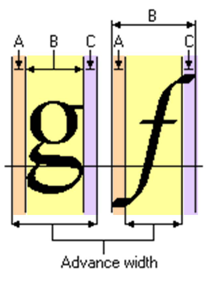
- `BOOL CDC::GetCharABCWidths(UINT nFirstChar, UINT nLastChar, LPABC lpabc)`;
- `BOOL CDC::GetCharWidth(UINT nFirstChar, UINT nLastChar, LPABC lpBuffer)`;
  - `lpBuffer` i `lpabc` moraju imati duzinu od barem *nLastChar - nFirstChar + 1*;

##### Vertikalna

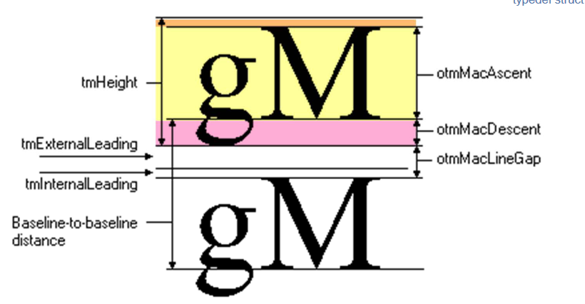
- `CSize CDC::GetTextExtent(const CString& str)` - racuna velicinu (sirinu i visinu) prosledjenog teksta ispisanog trenutno selektovanim fontom;

#### Najbitnija slika - fontovi

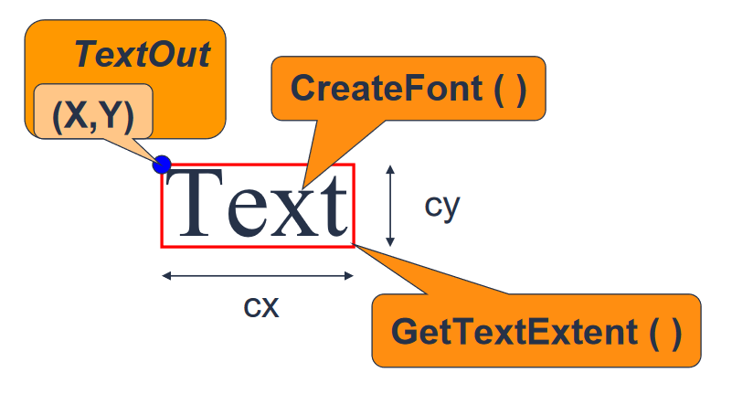

## Labovi

### Laboratorijska vezba 1 - Tangram

- [Kod](./Tangram/Tangram/TangramView.cpp);
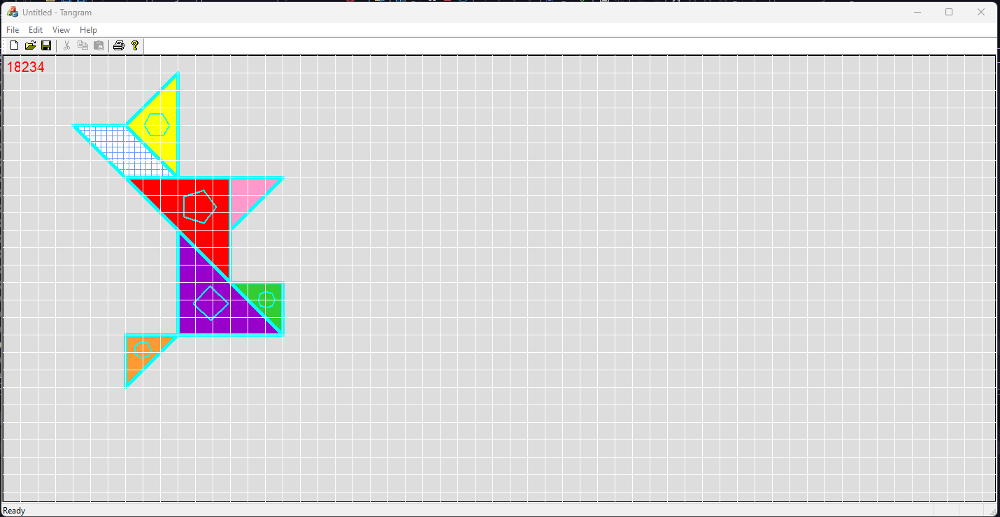

## References

- [Microsoft Learn - Windows GDI](https://learn.microsoft.com/en-us/windows/win32/gdi/windows-gdi);