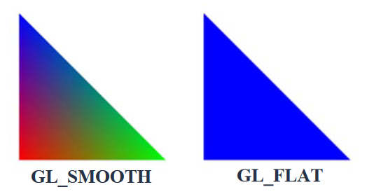
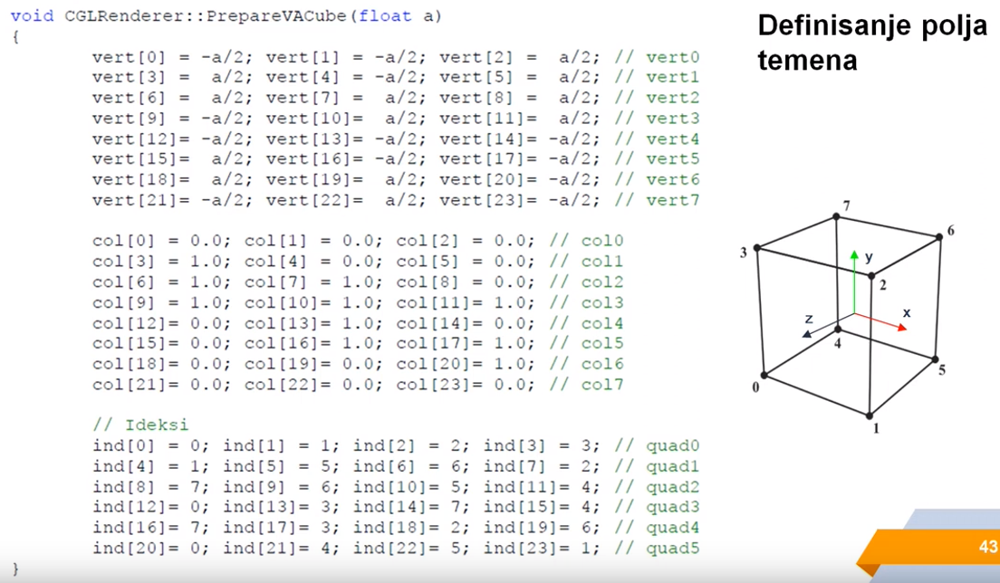

# OpenGL

Back to [main page](../).

## Racunske vezbe

### Prvi termin - Uvod u OpenGL

- istorijske informacije u  biblioteke/zaglavlja koja cine OpenGL ekosistem - prakticno nebitno za sam predmet, dobro da se zna;
- `CGLRenderer` - najbitnija klasa, formirana za potrebe predmeta, oslobadja nas od pisanja 'boilerplate'-a potrebnog da bi se OpenGL koristio sa MFC ekosistemom;
  - `bool CreateGLContext(CDC* pDC)` - kreiranje OpenGL Rendering Context;
  - `void PrepareScene(CDC* pDC)` - inicijalizacija scene, **predstavlja neku vrstu inicijalizatorske funkcije, pandan 'konstruktoru'**;
  - `void DestroyScene(CDC* pDC)` - oslobadjanje resursa alociranih u drugim funkcijama ove klase, **isti komentar kao za proslu funkciju, samo za 'destruktor'**;
  - `void Reshape(CDC* pDC, int w, int h)` - kod koji se izvrsava sa svakom promenom velicine prozora (`WM_SIZE`);
  - `void DrawScene(CDC* pDC)` - iscrtava scenu, **ovo je mesto sa koga se poziva najveci deo aplikativnog koda**;

#### Kreiranje osnovnog projekta

- za potrebe ovog predmeta, potrebno je preuzeti [templejt projekat - GLK](https://cs.elfak.ni.ac.rs/nastava/mod/resource/view.php?id=5198) i napraviti odredjene izmene:
  - funkcije koje se popunjavaju - `void CGLRenderer::PrepareScene(CDC* pDC)`, `void CGLRenderer::Reshape(CDC* pDC, int w, int h)`, `void CGLRenderer::DrawScene(CDC* pDC)`;
  - proizvoljno (ali jako pozeljno) je dodavanje hendlera za *iscrtavanje koordinatnih osa*, *rotiranje* i *zumiranje* scene;

#### Koordinatni sistem

- inicijalno vazi da X raste udesno, Y raste navise, Z raste prema posmatracu (desni koordinatni sistem);

#### Temena i primitive

- sve primitive definisane su preko temena (vertex) - definicija temena se obavlja pomocu funkcija nalik `glVertex3f(-1.0, -2.0, -5.0)`;
- tipovi primitiva:
  - `GL_POINTS`, `GL_LINES`, `GL_LINE_STRIP`, `GL_LINE_LOOP`, `GL_TRIANGLES`, `GL_TRIANGLE_STRIP`, `GL_TRIANGLE_FAN`, `GL_QUADS` (konveksan), `GL_QUAD_STRIP`, `GL_POLYGON` (konveksan);
- nekonveksne figure ne iscrtavaju se pravilno;
- **redosled zadavanja temena je bitan!!!**
- **Culling** - optimizacija;

#### Nacini sencenja

- `GL_SMOOTH` i `GL_FLAT`;

#### Polja temena - optimizacija

- ubrzava iscrtavanje;
- postupak:
  1. Popunjavanje polja podacima;

  2. Definisanje pokazivaca na polja (`glVertexPointer()`/`glColorPointer()`/...);
  3. Aktiviranje polja (`glEnableClientState()`);
  4. Crtanje geometrije (`glElementArray()`, `glDrawArrays()`, `glDrawElements()`, ...);
  5. Deaktiviranje polja (`glDisableClientState()`);

### Mali dodatak - Osnovna geometrijska tela (matematicki modeli)

- Cilindar;
- Kupa;
- Sfera;

### Drugi termin - Pogled u 3D

- postavljanje kamere, transformacije (centralna tema);

## References

- Official OpenGL [documentation](https://registry.khronos.org/OpenGL/index_gl.php);